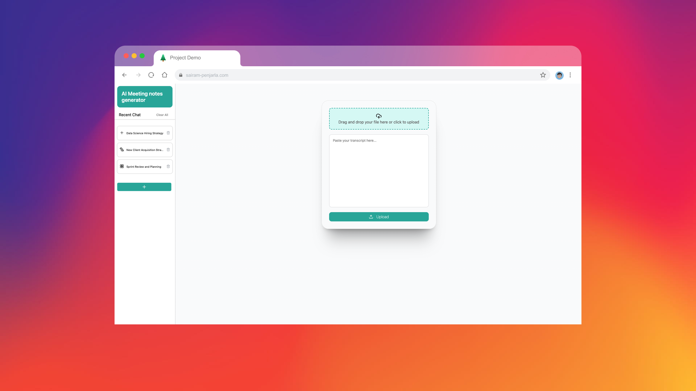
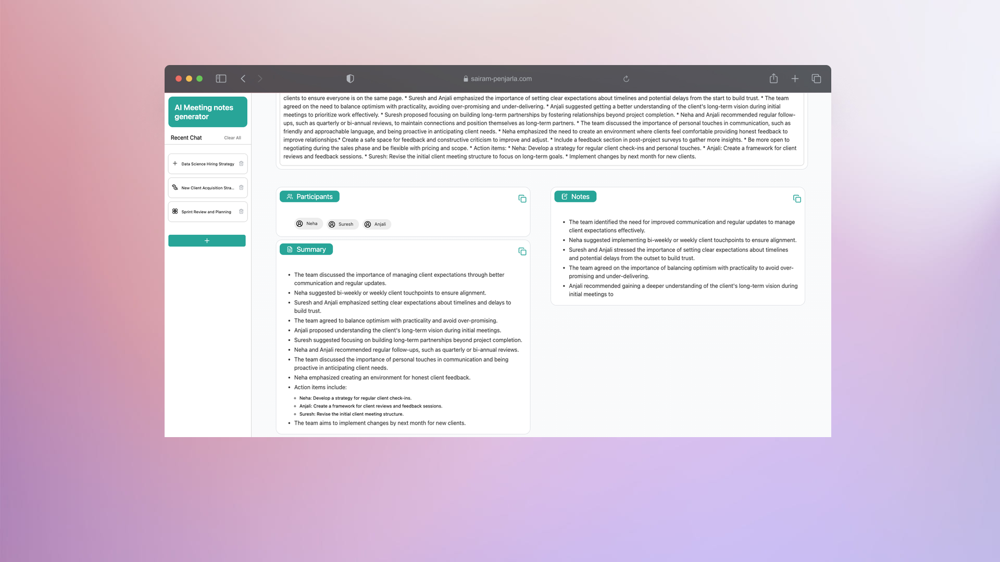
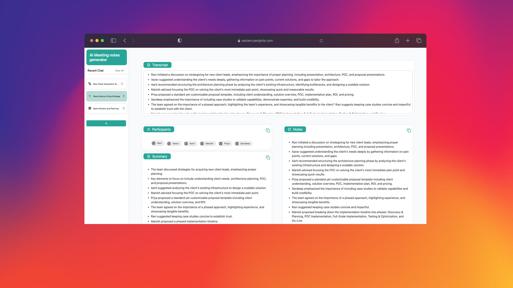
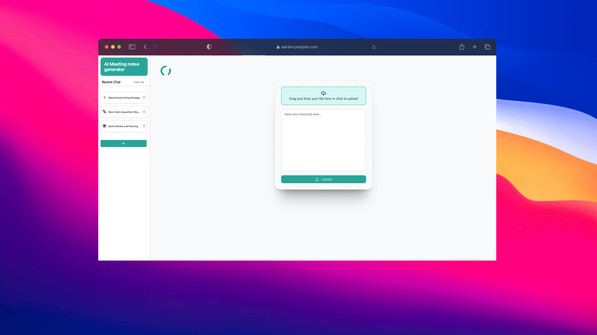

# [](https://psairam9301.wixsite.com/website) [](https://www.youtube.com/@sairampenjarla) [](https://github.com/sairam-penjarla) [](https://www.linkedin.com/in/sairam-penjarla-b5041b121/) [](https://www.instagram.com/sairam.ipynb/)

# Meeting Notes Generator AI Agent

## Demo Video

Check out the demo video to see the Meeting Notes Generator AI Agent in action: [Watch Demo](https://youtu.be/M0A9hVGspco)

## Instructions to Setup the Project

To get started with the project, follow these steps:

1. **Clone the GitHub repository:**
    ```bash
    git clone https://github.com/sairam-penjarla/meeting_notes_generator.git
    ```

2. **Change directory to the cloned repository:**
    ```bash
    cd meeting_notes_generator
    ```

3. **Set up a virtual environment:**
    If you are using Python, you can set up a virtual environment by following this blog post: [Link to Blog Post](https://sairampenjarla.notion.site/Environment-171d56a2fc2780dd9efcd4cef331fa2c).

    For example, using `venv`:
    ```bash
    python3 -m venv env
    source env/bin/activate  # For Linux/Mac
    .\env\Scripts\activate  # For Windows
    ```

    Alternatively, if you are using Anaconda, you can create an Anaconda environment.

4. **Install the required dependencies:**
    ```bash
    pip install -r requirements.txt
    ```

5. **Run the project:**
    ```bash
    python app.py
    ```

## Project Overview

This project is an AI agent that helps users in creating meeting notes automatically from uploaded meeting transcripts. The main goal is to reduce the time and effort spent in writing minutes of meetings, action items, summary, and participants.

### Key Features:
- **Meeting Note Generation:** Users can upload `.docx`, `.txt`, or `.vtt` files or even copy-paste the transcript of the meeting, and the AI agent will automatically generate:
  1. Participants list
  2. Meeting summary
  3. Meeting notes
  4. Action items

- **Previous Session Storage:** Once the meeting notes are generated, they are stored in a database. Users can revisit previous sessions via the sidebar.

- **Error Handling and Prompt Engineering:** The chatbot handles inappropriate or irrelevant requests using good prompt engineering techniques.

- **Interactive Session List:** Sessions are displayed in a sidebar with icons next to each session. Hovering over a session reveals a delete icon for session removal, and there’s also a “Clear All” button.

- **Real-Time Chatbot Response:** Using OpenAI's stream option, the chatbot responses are shown word-by-word, as though the AI is typing them.

- **Aesthetic UI:** The app features a modern and user-friendly design. Icons are sourced from [Lucide](http://lucide.dev/), and a loading animation is shown when the AI is generating meeting notes.

- **API Integration:** The project uses OpenAI API, which requires entering an API key in the `.env` file to get started. The `.env` file will be automatically picked up using the `dotenv` library.

- **Architecture and Documentation:** The project includes detailed logging, structured repository with `config.yaml`, `requirements.txt`, and media folder containing architecture diagrams (in PNG and [draw.io](http://draw.io/) format) and screenshots.

## Screenshot Preview

- **Upload Page:** Users can upload `.docx`, `.txt`, `.vtt` files or paste the transcript to start generating meeting notes.
  

- **Sidebar for Previous Sessions:** Hover over a session to see a light green overlay and options to delete or clear sessions.
  

- **Meeting Notes Output:** The generated meeting notes, participants list, summary, and action items.
  

- **Loading Animation:** This is shown while the AI is processing the meeting notes.
  

## Project Details and Further Explanation

For more details on how the AI agent works and how to use it, check out this blog post: [Meeting Notes Generator - Blog Post](https://sairampenjarla.notion.site/Meeting-Notes-Generator-18bd56a2fc2780b88319d34a2436342c).

## Repository Links

- **GitHub Repository:** [Meeting Notes Generator](https://github.com/sairam-penjarla/meeting_notes_generator)
